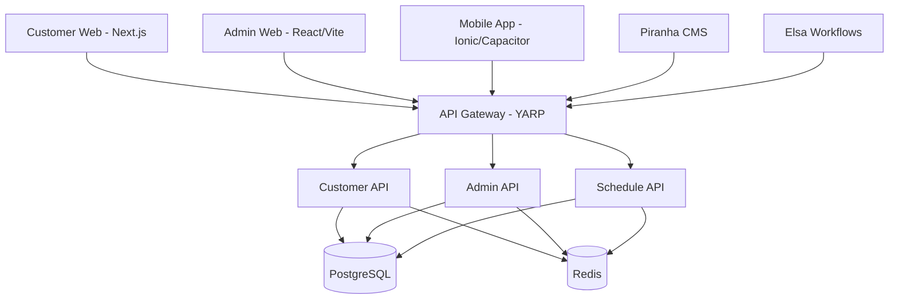

# .NET Monorepo Template
<p align="left">
  
</p>

A production-ready monorepo template for building scalable applications with an ASP.NET Core (.NET 10) backend and TypeScript frontends. This template provides a complete microservices architecture with shared C# common libraries and unchanged React/Next.js/Ionic frontends, making it ideal for rapid development of bespoke solutions.

> This repo was migrated off Node/Fastify/Prisma/Strapi/n8n onto ASP.NET Core — see [documentation/dotnet-migration-plan.md](documentation/dotnet-migration-plan.md) for the full record. Frontend apps were unaffected by the migration and remain TypeScript.

<p align="left">


</p>

## Stack split

**Backend is ASP.NET Core / C# (.NET 10).** Every service under `apps/backend/*`, every shared library under `common/*`, `apps/cms` (Piranha CMS), and `apps/automation` (Elsa Workflows) are C# now, built with the `dotnet` CLI and NuGet Central Package Management (`Directory.Packages.props`).

**Frontend is unchanged** — `admin-web` (React + Vite), `customer-web` (Next.js), and `customer-mobile` (Ionic + Capacitor) stay TypeScript, built with pnpm.

There is no shared runtime type package between backend and frontend. `common/DotNetMonoRepoTemplate.Types` (C#) is backend-only; frontend apps declare their own local TypeScript types for wire shapes.

## Architecture

### Structure Overview

```
zynkosi-tech-dot-net-mono-repo-template/
├── apps/
│   ├── automation/                 # Workflow automation — Elsa Workflows (.NET 10)
│   ├── backend/
│   │   ├── admin-api/              # Administrative backend service (ASP.NET Core, .NET 10)
│   │   ├── api-gateway/            # Main API gateway and routing layer (YARP, .NET 10)
│   │   ├── customer-api/           # Customer-facing API service (ASP.NET Core, .NET 10)
│   │   └── schedule-api/           # Scheduling and appointment management (ASP.NET Core, .NET 10)
│   ├── cms/                        # Headless CMS — Piranha CMS (.NET 10)
│   ├── frontend/
│   │   ├── admin-web/              # Admin dashboard (React + Vite)
│   │   └── customer-web/           # Customer web app (Next.js)
│   └── mobile/
│       └── customer-mobile/        # Mobile app (Ionic React + Capacitor)
├── common/                         # DotNetMonoRepoTemplate.* C# class libraries (ProjectReference only)
│   ├── DotNetMonoRepoTemplate.Cache/          # Redis caching service (StackExchange.Redis)
│   ├── DotNetMonoRepoTemplate.Database/       # EF Core AppDbContext, entities, migrations
│   ├── DotNetMonoRepoTemplate.Email/          # Email service with templates
│   ├── DotNetMonoRepoTemplate.Export/         # Export utilities (PDF, Excel — ClosedXML/CsvHelper)
│   ├── DotNetMonoRepoTemplate.Logging/        # Serilog-backed structured logging
│   ├── DotNetMonoRepoTemplate.Metrics/        # Metrics/telemetry
│   ├── DotNetMonoRepoTemplate.Observability/  # OpenTelemetry tracing/exporters
│   ├── DotNetMonoRepoTemplate.Queue/          # Background jobs (Hangfire + Redis storage)
│   ├── DotNetMonoRepoTemplate.Sms/            # SMS provider integration
│   ├── DotNetMonoRepoTemplate.Storage/        # File storage abstraction (Azure.Storage.Blobs)
│   ├── DotNetMonoRepoTemplate.Types/          # Shared C# DTOs/records (backend-only, no TS equivalent)
│   └── DotNetMonoRepoTemplate.Utilities/      # Common utility functions
├── devops/
│   ├── docker-compose.dev.yml      # Local dev infra (Postgres, Redis, Adminer, MailHog)
│   ├── docker-compose.nginx.yml    # Local Nginx reverse proxy
│   ├── k8s/                        # Kubernetes manifests
│   └── scripts/                    # DevOps automation scripts
├── infrastructure/
│   ├── nginx/                      # Nginx configurations
│   └── terraform/                  # Infrastructure as Code
├── docker-compose.yaml             # Canonical production/Coolify deployment stack
├── DotNetMonoRepoTemplate.sln       # Solution file — all backend services + common libraries
├── Directory.Packages.props        # NuGet Central Package Management — versions live here once
├── Directory.Build.props           # Solution-wide settings (.NET 10, nullable enabled, analyzers)
└── documentation/                  # Project documentation, including dotnet-migration-plan.md
```

### Request flow



## Getting Started

### Prerequisites

- .NET 10 SDK (backend services, common libraries, cms, automation)
- Node.js 22+ and pnpm 10+ (frontend/mobile apps only)
- Docker & Docker Compose
- PostgreSQL 16+
- Redis 7+

### Installation

1. Clone the repository:

   ```bash
   git clone <repository-url>
   cd zynkosi-tech-dot-net-mono-repo-template
   ```

2. Restore backend dependencies and build the solution:

   ```bash
   dotnet restore DotNetMonoRepoTemplate.sln
   dotnet build DotNetMonoRepoTemplate.sln
   ```

3. Install frontend/mobile dependencies:

   ```bash
   pnpm install
   ```

4. Start infrastructure (PostgreSQL, Redis, Adminer, MailHog):

   ```bash
   docker compose -f devops/docker-compose.dev.yml up -d
   ```

5. Set up environment variables — each backend service has its own `.env.example` (e.g. `apps/backend/admin-api/.env.example`); copy and fill in `DATABASE_URL`, `REDIS_URL`, and service-specific secrets:

   ```bash
   cp apps/backend/admin-api/.env.example apps/backend/admin-api/.env
   # repeat for customer-api, schedule-api, api-gateway, cms, automation
   ```

6. Apply EF Core migrations (developer-run — not automated by Claude in this repo):

   ```bash
   dotnet ef database update --project common/DotNetMonoRepoTemplate.Database --startup-project apps/backend/admin-api/src/AdminApi.csproj
   ```

7. Start development servers:

   ```bash
   # Backend services (run each from its project directory, or via the sln)
   dotnet run --project apps/backend/api-gateway/src/ApiGateway.csproj
   dotnet run --project apps/backend/admin-api/src/AdminApi.csproj
   dotnet run --project apps/backend/customer-api/src/CustomerApi.csproj
   dotnet run --project apps/backend/schedule-api/src/ScheduleApi.csproj

   # CMS and automation
   dotnet run --project apps/cms/src/Cms.csproj
   dotnet run --project apps/automation/src/WorkflowApi.csproj

   # Frontend
   pnpm dev:customer-web
   pnpm dev:admin-web
   ```

### Port Assignments

| Service | Port |
|---|---|
| api-gateway | 4000 |
| admin-api | 4001 |
| customer-api | 4002 |
| schedule-api | 4003 |
| customer-web (Next.js) | 3000 |
| admin-web (nginx, prod) / Vite dev server | 80 / 4004 |
| customer-mobile (Vite dev) | 5173 / 5174 |
| cms (Piranha) | 4005 |
| automation (Elsa Workflows) | 4006 |

### Frontend Scripts

| Script | Description |
|--------|-------------|
| `pnpm dev:customer-web` | Start Customer Web (Next.js) |
| `pnpm dev:admin-web` | Start Admin Web (Vite) |
| `pnpm build` | Build all frontend/mobile packages (Turborepo) |
| `pnpm test` | Run all frontend/mobile tests |
| `pnpm lint` | Lint all frontend/mobile packages |
| `pnpm format` | Format code with Prettier |

### Backend Commands

| Command | Description |
|--------|-------------|
| `dotnet build DotNetMonoRepoTemplate.sln` | Build every backend service + common library — must be zero errors/warnings before a task is complete (nullable warnings are errors) |
| `dotnet run --project apps/backend/<service>/src/<Service>.csproj` | Run a single backend service |
| `dotnet test apps/backend/<service>/tests/<Service>.Tests.csproj` | Run a service's unit tests (xUnit) |
| `dotnet ef migrations add <Name> --project common/DotNetMonoRepoTemplate.Database --startup-project apps/backend/<service>/src/<Service>.csproj` | Add an EF Core migration (developer-run) |

## Workflow Automation (Elsa Workflows)

`apps/automation` is an ASP.NET Core (.NET 10) service hosting Elsa Workflows, not n8n — see [apps/automation/README.md](apps/automation/README.md) for local development and environment variables.

```bash
dotnet run --project apps/automation/src/WorkflowApi.csproj
```

## Headless CMS (Piranha CMS)

`apps/cms` is an ASP.NET Core (.NET 10) service hosting Piranha CMS, not Strapi — see [apps/cms/README.md](apps/cms/README.md) for local development and environment variables.

```bash
dotnet run --project apps/cms/src/Cms.csproj
```

> Both `apps/cms` and `apps/automation` were empty scaffolds at migration time (no custom Strapi content types, no real n8n workflows) — treat their framework-integration code (Piranha's `AddPiranha`/`UsePiranha`, Elsa's `AddElsa`/`UseWorkflowManagement`/`UseWorkflowRuntime`) as needing a real `dotnet build` pass before it's trusted; see each app's README for specifics.

## Package Management

Two package managers, split by stack — don't cross them:

- **Backend (C#)**: the `dotnet` CLI with **NuGet Central Package Management** — every package version lives once in root `Directory.Packages.props`; individual `.csproj` files reference packages by name only. Internal library references use `<ProjectReference>`, never a package feed. Solution-wide settings (target framework, nullable, analyzers) live in root `Directory.Build.props`.
- **Frontend/mobile (TypeScript)**: pnpm workspaces — always `pnpm`, never `npm` or `yarn`, for anything under `apps/frontend/*` or `apps/mobile/*`. Internal deps use `workspace:*`.

### Adding Backend Dependencies

```bash
# 1. Add the package + version once to Directory.Packages.props
# 2. Reference it by name only in the target .csproj
dotnet add apps/backend/customer-api/src/CustomerApi.csproj package <PackageName>
```

### Adding Frontend Dependencies

```bash
# Add to a specific package
pnpm --filter admin-web add axios

# Add to root (dev dependency)
pnpm add -D -w typescript

# Add to all frontend/mobile packages
pnpm -r add lodash
```

## Commit Message Convention

This project uses [Conventional Commits](https://www.conventionalcommits.org/) enforced by Husky and Commitlint. All commits must follow this format:

```
<type>(<scope>): <subject>

[optional body]

[optional footer]
```

### Commit Types

| Type | Description |
|------|-------------|
| `feat` | A new feature |
| `fix` | A bug fix |
| `docs` | Documentation changes only |
| `style` | Code style changes (formatting, etc.) |
| `refactor` | Code refactoring (no feature or bug fix) |
| `perf` | Performance improvements |
| `test` | Adding or updating tests |
| `build` | Build system or external dependency changes |
| `ci` | CI/CD configuration changes |
| `chore` | Maintenance tasks, tooling, configs |
| `revert` | Reverting a previous commit |
| `wip` | Work in progress (use sparingly) |

### Scopes

Scopes help identify which part of the codebase is affected:

**Backend Services (C#):**
`api-gateway`, `customer-api`, `admin-api`, `schedule-api`, `cms`, `automation`

**Frontend Apps (TypeScript):**
`customer-web`, `admin-web`, `customer-mobile`

**Common Libraries (C#):**
`database`, `cache`, `config`, `email`, `sms`, `export`, `logging`, `metrics`, `observability`, `queue`, `storage`, `types`, `utilities`

**Other:**
`deps`, `ci`, `docs`, `release`

### Examples

```bash
# Feature with scope
git commit -m "feat(customer-api): add user profile endpoint"

# Bug fix
git commit -m "fix(database): resolve connection pool leak"

# Documentation
git commit -m "docs: update README with commit conventions"

# Chore (maintenance)
git commit -m "chore(deps): update dependencies"

# Breaking change (add ! after type)
git commit -m "feat(api-gateway)!: change authentication flow"

# With body for more context
git commit -m "refactor(admin-web): migrate to React Query

- Replace useEffect data fetching
- Add proper caching
- Implement optimistic updates"
```

### Rules

- **Type**: Required, must be lowercase
- **Scope**: Optional but recommended, must be from allowed list
- **Subject**: Required, lowercase, no period at end, max 100 chars
- **Body**: Optional, wrap at 200 chars

## Changesets & Releases

Frontend/mobile packages use [Changesets](https://github.com/changesets/changesets) for version management and changelog generation. Backend C# projects are versioned via the `.sln`/`.csproj` files and are not part of the changeset flow.

### Creating a Changeset

When you make changes to a frontend/mobile package that should be released:

```bash
pnpm changeset
```

Follow the prompts to:
1. Select changed packages
2. Choose version bump type (major/minor/patch)
3. Write a summary of changes

### Version & Publish

```bash
# Update versions based on changesets
pnpm changeset:version

# Build and publish
pnpm changeset:publish
```

## Naming Conventions

This template follows strict naming conventions for consistency:

| Context | Convention | Example |
|---------|------------|---------|
| Database tables/columns | snake_case | `user_profiles`, `created_at` |
| API responses (wire format) | camelCase | `userId`, `createdAt` |
| C# classes, records, DTOs | PascalCase | `UserService`, `CreateUserDto` |
| C# properties | PascalCase | `UserId`, `IsActive` |
| Backend file names | PascalCase, one type per file | `CreateUserDto.cs`, `UserService.cs` |
| TypeScript variables/functions | camelCase | `getUserById`, `isActive` |
| TypeScript classes/interfaces | PascalCase | `UserService`, `CreateUserDto` |
| Frontend file names | kebab-case | `user-profile.route.ts` |
| React components | PascalCase | `UserProfile.tsx` |
| Constants | UPPER_SNAKE_CASE | `API_BASE_URL` |

EF Core (via `EFCore.NamingConventions`) handles the transformation between snake_case database columns and PascalCase C# entity properties; System.Text.Json serializes C# properties to camelCase on the wire.

For detailed guidelines, see [documentation/NAMING_CONVENTIONS.md](documentation/NAMING_CONVENTIONS.md)

## Testing

### Backend (xUnit)

```bash
# Run tests for a single service
dotnet test apps/backend/customer-api/tests/CustomerApi.Tests.csproj

# Run every test project in the solution
dotnet test DotNetMonoRepoTemplate.sln
```

Each service's tests live under `apps/backend/<service>/tests/`, mirroring the `Services/` folder structure being tested.

### Frontend/Mobile

```bash
# Run all tests
pnpm test

# Run with coverage
pnpm test:coverage

# Run tests for a specific package
pnpm --filter admin-web test
```

## Building

```bash
# Backend — zero errors and zero warnings required (nullable warnings are errors)
dotnet build DotNetMonoRepoTemplate.sln

# Frontend/mobile
pnpm build
```

## Docker & Deployment

### Development

```bash
# Start dev infrastructure (Postgres, Redis, Adminer, MailHog)
docker compose -f devops/docker-compose.dev.yml up -d

# Stop dev infrastructure
docker compose -f devops/docker-compose.dev.yml down
```

### Production

```bash
# Build and start the full production stack (all backend + frontend services)
docker compose -f docker-compose.yaml up -d --build
```

Each backend service (`admin-api`, `customer-api`, `schedule-api`, `api-gateway`, `cms`, `automation`) builds from its own multi-stage Dockerfile: `mcr.microsoft.com/dotnet/sdk:10.0` for build, `mcr.microsoft.com/dotnet/aspnet:10.0` for runtime. Frontend apps (`customer-web`, `admin-web`) build via their own `apps/frontend/<app>/Dockerfile` with pnpm.

### Kubernetes

```bash
kubectl apply -f devops/k8s/
```

## Deployment — Coolify is canonical

This project deploys to a self-hosted VPS via [Coolify](https://coolify.io/) — the only deployment path used for this template (no Render, raw SSH, or Kamal). `docker-compose.yaml` at the repo root is the single Coolify deployment stack, covering every backend service, `cms`, `automation`, and both frontend apps, plus managed Postgres/Redis and git-push auto-deploy.

- **VPS bootstrap** (one-time, before Coolify exists): base hardening, firewall, fail2ban, and installing Coolify itself.
- **Coolify setup**: per-application config, multi-stage .NET Dockerfile builds, pnpm builds for frontend, environment variables, managed Postgres/Redis, DNS.

#### Connecting Your Repository

1. In Coolify, go to **Sources** → **Add GitHub App** (or use a deploy key)
2. Select the `zynkosi-tech-dot-net-mono-repo-template` repository
3. Set up auto-deploy on push to `main` (or your target branch)

#### Deploying a Service (Monorepo Pattern)

Each app in `apps/` is deployed as a separate Coolify service. Key settings:

| Setting | Value |
|---------|-------|
| **Build Pack** | `Dockerfile` |
| **Base Directory** | `/` _(always root — never the app subfolder)_ |
| **Dockerfile Location** | `apps/backend/<service-name>/Dockerfile` (backend) or `apps/frontend/<app>/Dockerfile` (frontend) |
| **Port** | Match the app's port — see [Port Assignments](#port-assignments) |

> **Base Directory must always be `/`** — setting it to the app subfolder loses access to `common/`, the root `Directory.Packages.props`/`.sln` (backend), or `pnpm-workspace.yaml` (frontend), which breaks the monorepo build.

#### Coolify Environment Secrets

Set secrets per-service in Coolify's **Environment Variables** UI — these override anything in `.env` files and are injected at runtime. Never bake secrets into a Docker image. Backend services read secrets exclusively through their `<Service>Options` class, never `Environment.GetEnvironmentVariable` scattered through business logic. Database connections use `DATABASE_URL` only; Redis connections use `REDIS_URL` only — no discrete host/port/password fallbacks anywhere in the stack.

For the full one-time VPS bootstrap and step-by-step Coolify deployment guide, delegate to the `vps-bootstrap` and `deployment-coolify` subagents, or see `.claude/agents/vps-bootstrap.md` and `.claude/agents/deployment-coolify.md`.

## Documentation

| Document | Description |
|----------|-------------|
| [.NET Migration Plan](documentation/dotnet-migration-plan.md) | Full record of the Node → .NET backend migration |
| [API Versioning](documentation/API-VERSIONING.md) | API versioning strategy |
| [File Upload](documentation/FILE-UPLOAD.md) | File upload handling |
| [Export](documentation/EXPORT.md) | PDF/Excel export guide |
| [Quality Gates](documentation/QUALITY_GATES.md) | Code quality standards |
| [Workflow Automation](apps/automation/README.md) | Elsa Workflows setup |
| [CMS](apps/cms/README.md) | Piranha CMS setup |
| [DevOps](devops/README.md) | Docker & Kubernetes setup |

## Contributing

1. Create a feature branch from `main`
2. Make your changes following the coding conventions in `CLAUDE.md`
3. Backend: run `dotnet build DotNetMonoRepoTemplate.sln` (zero errors/warnings) and add/update xUnit tests under `apps/backend/<service>/tests/`
4. Frontend: run `pnpm --filter <app> tsc --noEmit` (zero errors) and add/update tests where feasible
5. For frontend/mobile package changes, create a changeset: `pnpm changeset`
6. Commit using conventional commit format
7. Open a Pull Request

### Pre-commit Hooks

Husky runs the following checks before each commit:
- **Lint-staged**: ESLint and Prettier on staged TypeScript/frontend files
- **Commitlint**: Validates commit message format
- **Type check**: TypeScript compilation check (frontend/mobile)

## License

See LICENSE file for details.
