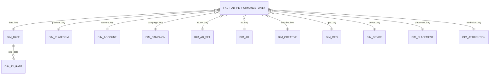

# Marketing Canonical Data Model

Status: proposed
Last reviewed: 2026-09-03
Related: [Platform Architecture](./marketing-data-platform.md), [Delivery Roadmap](./marketing-ingestion-roadmap.md)

This document defines the target shape that every marketing source is normalised
into, the rules that govern that normalisation, and the source-to-canonical
mappings. It is the contract between the extraction layer and everything
downstream.

## 1. Grain

The core fact is:

> One row per **metric date**, **platform**, **account**, **entity** (campaign,
> ad set or ad), **breakdown combination** and **attribution window**.

Three parts of that grain are frequently omitted by teams building this and each
omission causes a specific, recurring bug:

- **Breakdown combination.** Without it, an ad-day appears once when breakdowns
  are off and eight times when they are on, and totals silently double.
- **Attribution window.** Without it, a re-pull under a different window
  overwrites the previous figure and history becomes incoherent.
- **Metric date rather than ingest date.** Without the distinction, restated
  data lands on the wrong day.

Entity level is carried explicitly (`entity_level` in `campaign | ad_set | ad`)
rather than through separate tables per level. Platforms disagree on hierarchy
depth — TikTok's ad group maps to Meta's ad set, some partner APIs have only one
level — and a single fact with an explicit level absorbs that without schema
churn.

## 2. Dimensional model



### 2.1 `silver.fact_ad_performance_daily`

| Column | Type | Notes |
|---|---|---|
| `date_key` | `DATE` | Metric date in the reporting timezone. Partition column |
| `platform_key` | `INT` | |
| `account_key` | `BIGINT` | |
| `entity_level` | `STRING` | `campaign`, `ad_set`, `ad` |
| `entity_id` | `STRING` | Native platform ID, never re-keyed |
| `campaign_key` | `BIGINT` | Surrogate, SCD2-resolved as at `date_key` |
| `ad_set_key` | `BIGINT` | Nullable |
| `ad_key` | `BIGINT` | Nullable |
| `creative_key` | `BIGINT` | Nullable |
| `geo_key` | `INT` | `-1` when the breakdown was not requested |
| `device_key` | `INT` | `-1` when not requested |
| `placement_key` | `INT` | `-1` when not requested |
| `attribution_key` | `INT` | Resolves to the click and view window pair |
| `breakdown_hash` | `STRING` | Deterministic hash of the resolved breakdown keys. Part of the MERGE key |
| `impressions` | `BIGINT` | Additive |
| `clicks` | `BIGINT` | Additive |
| `spend_native` | `DECIMAL(18,4)` | In `currency_code` |
| `currency_code` | `STRING` | ISO 4217 |
| `fx_rate_to_zar` | `DECIMAL(18,8)` | The rate actually applied, retained for audit |
| `spend_zar` | `DECIMAL(18,4)` | Reporting currency |
| `conversions` | `DECIMAL(18,4)` | Fractional on platforms that model partial attribution |
| `conversion_value_native` | `DECIMAL(18,4)` | |
| `conversion_value_zar` | `DECIMAL(18,4)` | |
| `video_views` | `BIGINT` | **Not comparable across platforms.** See section 4 |
| `video_views_p25/p50/p75/p100` | `BIGINT` | Comparable; quartiles are consistently defined |
| `engagements` | `BIGINT` | **Not comparable across platforms** |
| `reach` | `BIGINT` | **Non-additive.** See section 5 |
| `frequency` | `DECIMAL(9,4)` | **Non-additive** |
| `source_date` | `DATE` | The date as the platform reported it, before timezone normalisation |
| `source_timezone` | `STRING` | IANA name of the account's reporting timezone |
| `payload_hash` | `STRING` | Change detection for restatement skipping |
| `run_id` | `STRING` | Lineage back to the exact source response |
| `ingested_at_utc` | `TIMESTAMP` | |
| `restated_at_utc` | `TIMESTAMP` | Set when a MERGE updates an existing row |

Derived rates are absent by design. CTR, CPC, CPM, CPA and ROAS are computed in
the semantic layer from the stored sums. A stored rate cannot be correctly
re-aggregated, and averaging stored CTRs across campaigns produces a number that
looks plausible and is wrong.

### 2.2 Dimensions

| Table | Type | Notes |
|---|---|---|
| `dim_date` | Static | Calendar plus fiscal period, South African public holidays, week starting Monday |
| `dim_platform` | Type 1 | `tiktok_ads`, `meta_facebook`, `meta_instagram`, and one row per partner and legacy source |
| `dim_account` | Type 2 | Account name, native currency, reporting timezone, owning business unit |
| `dim_campaign` | Type 2 | Name, objective, status, budget, start and end. Names and budgets change mid-flight, so point-in-time correctness is required |
| `dim_ad_set` | Type 2 | Targeting summary, bid strategy, budget |
| `dim_ad` | Type 2 | Status, creative reference |
| `dim_creative` | Type 2 | Asset type, thumbnail URL, headline, body, landing URL, UTM parameters parsed into columns |
| `dim_geo` | Type 1 | Normalised to ISO 3166-1 alpha-2 and, where available, ISO 3166-2 subdivision |
| `dim_device` | Type 1 | Normalised to `mobile`, `desktop`, `tablet`, `connected_tv`, `other` |
| `dim_placement` | Type 1 | Normalised placement taxonomy, with the platform's native value retained |
| `dim_attribution` | Type 1 | Click window days, view window days, engagement window days |
| `dim_fx_rate` | Type 1 | One row per currency pair per day |
| `dim_metric_definition` | Type 1 | The metric taxonomy from section 4 |

Type 2 is not decoration on the campaign and ad set dimensions. A campaign
renamed from "Spring Sale" to "Spring Sale ZA" mid-quarter must not retroactively
rename three months of history, and a budget raised on the 15th must not make the
first half of the month look like it was under-pacing.

### 2.3 Gold layer

| Table | Grain | Purpose |
|---|---|---|
| `gold.fact_channel_performance_daily` | Same as silver fact, dimensions denormalised | Power BI ad-hoc exploration |
| `gold.agg_channel_rollup_daily` | `date`, `platform`, `channel`, `campaign` | The marketing manager's landing screen. Deliberately small |
| `gold.agg_creative_performance_weekly` | `week`, `platform`, `creative` | Creative effectiveness review |
| `gold.dim_*_current` | Current row only | Simple filtering surfaces for BI users who should not have to reason about SCD2 |

## 3. Normalisation rules

These are the rules that turn source-shaped bronze into canonical silver. Each
one exists because getting it wrong produces a specific wrong number.

### 3.1 Timezone

Every ad account reports in its own configured timezone. Meta reports in the ad
account's timezone; TikTok in the advertiser's; partner APIs vary and legacy
APIs frequently do not say.

**Rule.** `Africa/Johannesburg` is the canonical reporting timezone. All
`date_key` values are normalised to it. Retain `source_date` and
`source_timezone` unchanged for reconciliation, because when the vendor's own UI
is compared against the dashboard, the difference will be a timezone boundary far
more often than it is a bug.

**Caveat, given a 200-plus account portfolio.** A single canonical timezone is
correct for consolidated reporting and for the marketing manager's cross-portfolio
view. It is not automatically correct for an account manager looking at one
account in another market, whose day boundary genuinely differs. The fact already
carries `source_date`, so gold additionally exposes an `account_local_date` view
over the same rows. Consolidated reporting uses `date_key`; per-account
operational views may use `account_local_date`. The two must never be mixed in
one visual, and the semantic layer names them distinctly rather than calling both
"date" so the distinction survives contact with a report builder.

Where a source provides only a date and no timezone, treat it as the account's
configured timezone and record the assumption in `dim_account`. Never assume
UTC silently — for a South African account that shifts every figure by two hours
and moves a measurable share of late-evening spend to the wrong day.

### 3.2 Currency

**Rule.** Store `spend_native` with its `currency_code`, plus `spend_zar` and
the `fx_rate_to_zar` that was actually applied. Use the daily closing rate for
the metric date, not the rate at ingestion time — otherwise a restatement three
weeks later revalues historical spend and last month's report changes after it
was signed off.

Populate `dim_fx_rate` from a single authoritative source and treat a missing
rate as a blocking quality failure, not as a reason to default to 1.0.

### 3.3 Entity resolution

Native platform IDs are the natural key and are never re-keyed. Surrogate keys
exist only for the SCD2 dimension join. Where the same campaign runs across
platforms and the business considers it one campaign, that grouping belongs in a
`dim_campaign_group` mapping table maintained by the marketing team, not in an
inferred name match. Fuzzy-matching campaign names to unify them across
platforms looks clever in a demo and produces indefensible numbers in production.

### 3.4 Deleted and archived entities

Facts survive their dimensions. When a campaign is deleted upstream, the SCD2
row is closed with `is_deleted = true` and historical facts remain untouched.
A deleted campaign that spent R400,000 last quarter still spent it.

### 3.5 Restatement window

**Rule.** Every daily load re-pulls a rolling window and MERGEs rather than
appending. The window is 28 days at its widest and is set per connector on
`SourceConnector`, driven by two things: what the platform actually restates, and
the account's tier.

Platforms differ — Meta restates for up to 28 days, some partner APIs for 7, and
legacy sources often never restate at all, where 2 days is enough. Account tier
narrows it further: Tier 1 accounts carry the full 28 days, Tier 2 fourteen, Tier
3 seven. That is not a correctness compromise so much as a proportionality one.
The overwhelming majority of restatement value sits in the accounts carrying the
overwhelming majority of spend, and re-pulling 28 days for 240 long-tail accounts
consumes API quota that Tier 1 needs more.

Measure this rather than assuming it. The `payloadHash` change rate per source
and per day-offset tells you exactly how far back restatement actually reaches,
and the windows should be tuned to that evidence once a quarter of history
exists.

## 4. Metric comparability

The most consequential modelling decision in this platform. Platforms use the
same words for different measurements.

| Canonical metric | Comparable across platforms | Reason |
|---|---|---|
| `impressions` | Yes | Consistently defined as a served impression |
| `clicks` | With care | Meta's default includes engagement clicks; the link-click variant is the comparable one and is what should be mapped |
| `spend` | Yes, once currency-normalised | |
| `reach` | Within a platform only | Each platform deduplicates users within its own graph and cannot deduplicate across |
| `video_views` | **No** | Meta counts a view at 2 seconds, TikTok at 6 seconds, others at 3 or at 100% |
| `video_views_p25/p50/p75/p100` | Yes | Quartile completion is defined identically |
| `engagements` | **No** | Each platform includes a different set of interaction types |
| `conversions` | Only within an aligned attribution window | See below |
| `conversion_value` | Only within an aligned attribution window | |

`dim_metric_definition` carries a `comparable_across_platforms` flag and the
per-platform definition text. The semantic layer refuses to blend a
non-comparable metric across platforms without an explicit label on the visual.

The practical consequence for the dashboard: video views must be shown per
platform or replaced with the 25% completion metric when a cross-platform total
is wanted. A blended "video views" figure across TikTok and Meta is not a
measurement of anything.

## 5. Additivity

| Class | Metrics | Aggregation rule |
|---|---|---|
| Fully additive | impressions, clicks, spend, conversions, conversion value, video quartiles | Sum across every dimension |
| Semi-additive | budget, bid | Sum across entities, never across time. A daily budget summed over 30 days is not a monthly budget |
| Non-additive | reach, frequency, unique users, CTR, CPC, CPM, ROAS | Never summed. Rates are recomputed from summed components. Reach is only valid at the grain the platform reported it |

Reach deserves specific attention because it is the metric most often summed
incorrectly. Summing daily reach across a week overstates weekly reach by the
number of repeat users, which for a typical retargeting campaign is most of
them. The gold layer must not pre-aggregate reach across time. Where a weekly
or monthly reach figure is genuinely needed, request it from the platform at
that grain as a separate pull, or model it with HyperLogLog sketches where the
platform exposes user-level data, which most do not.

## 6. Attribution windows

Every platform ships a different default:

| Platform | Typical default |
|---|---|
| Meta | 7-day click, 1-day view |
| TikTok | 7-day click, 1-day view, with a different engagement definition |
| Partner APIs | Frequently last-click, unspecified window |
| Legacy APIs | Usually no concept of attribution at all |

**Rule.** The standard window is **7-day click, 1-day view**. It is requested
explicitly from every platform that supports it, stored as `attribution_key` on
the fact, and it is the only window exposed in gold for cross-platform
comparison.

Two reasons for that choice over any other. It matches the current default on
both major platforms in scope, so it is the window their own UIs display, which
means the dashboard reconciles against what the marketing team already sees
rather than requiring an explanation every time the numbers differ. And it is
requestable from both without an additional report pull, so alignment costs no
extra API quota — which matters at 200-plus accounts.

Where a platform returns several windows in one response at no additional cost,
store them all; the extra rows are cheap and a sensitivity analysis on
attribution becomes possible later without a backfill. Where a source cannot
supply the aligned window — most legacy sources have no concept of attribution —
it maps to an `unspecified` attribution row and is excluded from cross-platform
conversion comparison rather than blended in.

Conversion figures compared across platforms on mismatched windows are the most
common way a marketing dashboard produces a confidently wrong recommendation.

### 6.1 Which actions count as a conversion

Attribution window alignment is wasted if the two platforms are counting
different actions. The standard conversion set is:

| Action class | Counted | Notes |
|---|---|---|
| Purchase | Yes | The primary conversion for commerce campaigns |
| Lead / form submission | Yes | Counted as a conversion event only. No personal data is ingested — see the PII scope boundary in the architecture document |
| Complete registration | Yes | |
| Initiate checkout | **No** | An intent signal, not an outcome. Including it roughly triples conversion counts and makes CPA look flattering |
| Add to cart, page view, content view | **No** | Same reasoning, more so |
| App install | Configurable per account | Genuinely an outcome for app campaigns, noise for everything else |

This set is the governed default, stored in a `ConversionActionMapping`
control-plane entity and overridable per account where a business unit measures
something legitimately different. Overrides are audited, because a silent change
to what counts as a conversion moves every efficiency metric on the dashboard
without any visible cause.

Offline and store-visit conversions are excluded from the standard set. They
arrive on a different latency, restate for far longer than 28 days, and mixing
them into the same measure makes the restatement window meaningless.

## 7. Source-to-canonical mappings

Full field-level mappings live alongside each connector as versioned contract
files under `apps/backend/ingestion-api/Contracts/<source>/<version>/`. The
extracts below show the shape and the decisions that matter.

### 7.1 TikTok Ads — `ad_insights_daily` (JSON)

| Source field | Canonical | Transformation |
|---|---|---|
| `stat_time_day` | `source_date` then `date_key` | Parse, then convert from advertiser timezone |
| `advertiser_id` | `account_key` | Lookup in `dim_account` |
| `ad_id` | `entity_id`, `entity_level = 'ad'` | |
| `spend` | `spend_native` | String to decimal. TikTok returns numerics as strings |
| `impressions`, `clicks` | direct | String to integer |
| `conversion` | `conversions` | |
| `video_play_actions` | not mapped to `video_views` | 6-second definition; mapped to a platform-native column only |
| `video_watched_2s` | `video_views` | The Meta-comparable definition where a comparison is required |
| `country_code` | `geo_key` | Already ISO 3166-1 alpha-2 |

### 7.2 Meta Marketing API — `insights` (JSON)

| Source field | Canonical | Transformation |
|---|---|---|
| `date_start` | `source_date` then `date_key` | Convert from ad account timezone |
| `account_id` | `account_key` | Strip the `act_` prefix |
| `spend` | `spend_native` | String to decimal |
| `inline_link_clicks` | `clicks` | **Not** `clicks`, which includes engagement clicks and is not comparable |
| `actions[]` | `conversions` | Filter to the configured conversion action types, then sum. The array shape is the main normalisation work |
| `action_values[]` | `conversion_value_native` | Same filter |
| `reach` | `reach` | Flagged non-additive |
| `publisher_platform` | `dim_platform` split | This is what separates Facebook from Instagram rows within one Meta pull |

Instagram is not a separate API. It is the `publisher_platform` breakdown on the
Meta Insights response. Modelling it as a separate connector duplicates the pull
and doubles the rate-limit cost; modelling it as a breakdown gets both platforms
from one request.

### 7.3 Legacy XML ad server — `booking_report` (XML)

```xml
<BookingReport xmlns="urn:legacy:adserver:v2">
  <ReportDate>01/09/2026</ReportDate>
  <Currency>ZAR</Currency>
  <Booking id="BK-88213">
    <CampaignName>Spring Sale</CampaignName>
    <Impressions>1204221</Impressions>
    <Cost>41275.50</Cost>
  </Booking>
</BookingReport>
```

| Source path | Canonical | Transformation |
|---|---|---|
| `/BookingReport/ReportDate` | `date_key` | **`dd/MM/yyyy`, not ISO.** Parse with an explicit culture-invariant format; never rely on ambiguous parsing, which silently swaps day and month for the first twelve days of every month |
| `/BookingReport/Currency` | `currency_code` | |
| `Booking/@id` | `entity_id`, `entity_level = 'campaign'` | |
| `Booking/CampaignName` | `dim_campaign.name` | |
| `Booking/Impressions` | `impressions` | |
| `Booking/Cost` | `spend_native` | |
| absent | `attribution_key` | Mapped to `unspecified`; excluded from conversion comparisons |
| absent | `clicks`, `conversions` | `NULL`, not zero. Zero is a measurement; null is an absence, and charting them identically understates this channel's performance |

The null-versus-zero distinction is the recurring trap with legacy sources.
Defaulting missing metrics to zero makes a channel that simply does not report
clicks look like a channel with no clicks.

## 8. Quality rules

| Rule | Severity | Action on failure |
|---|---|---|
| Natural key components non-null | Blocking | Quarantine the record |
| `spend_native >= 0` | Blocking | Quarantine |
| `clicks <= impressions` | Warning | Load and flag. Some platforms legitimately violate this at low volumes because of attribution timing |
| `currency_code` in ISO 4217 | Blocking | Quarantine |
| FX rate present for the metric date | Blocking | Fail the batch. A missing rate is an upstream problem, not a record problem |
| `date_key` within the requested window | Blocking | Quarantine and alert. This usually means a timezone bug |
| Daily spend per platform within 0.5% of the vendor's own summary endpoint | Blocking | Block gold publication, alert |
| Row count within 3 standard deviations of the 28-day mean | Warning | Alert, do not block |
| No duplicate natural keys in the increment | Blocking | Fail the batch. Duplicates mean broken pagination |
