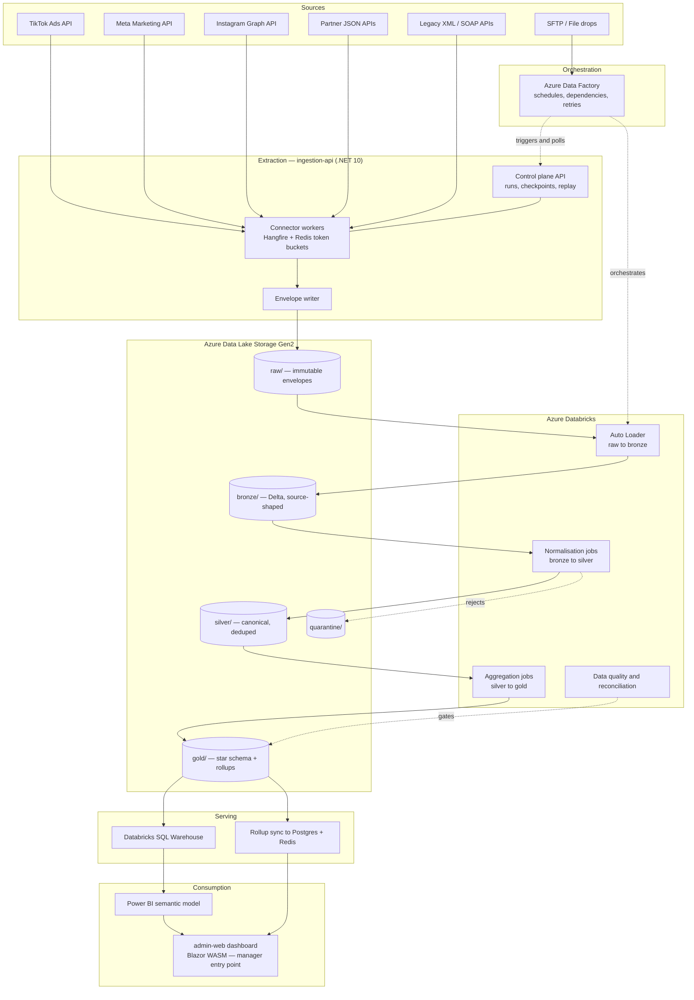

# Marketing Data Platform — Ingestion and Analytics Architecture

Status: proposed
Owner: Data Platform
Last reviewed: 2026-09-03
Related: [Canonical Data Model](./marketing-canonical-data-model.md), [Delivery Roadmap](./marketing-ingestion-roadmap.md)

## 1. Problem statement

Marketing performance data arrives from several unrelated systems with no shared
shape, no shared vocabulary and no shared cadence:

| Stream family | Examples | Transport | Payload | Cadence |
|---|---|---|---|---|
| Owned social/ads platforms | TikTok Ads, Meta (Facebook), Meta (Instagram) | Vendor REST API, OAuth 2.0, async report jobs | JSON | Hourly / daily pulls, restated for up to 28 days |
| Modern partner APIs | Affiliate networks, agency reporting, ad servers | REST, API key or OAuth | JSON | Daily |
| Legacy partner APIs | Older ad servers, print/radio bookings, media agencies | SOAP / HTTP-GET returning XML | XML (XSD, sometimes only a sample) | Daily / weekly |
| Manual and file drops | Agency spend workbooks, offline campaign costs | SFTP, email-to-blob, admin upload | CSV / XLSX | Weekly / ad hoc |
| Event streams (future) | Pixel postbacks, lead-ad webhooks | Webhook / Event Hubs | JSON | Continuous |

The marketing manager needs one entry point that answers a single question
reliably: **which streams are performing best, for what spend**. Everything in
this document exists to make that one answer trustworthy.

Target scale is 100M+ rows in the performance fact table. With the portfolio
confirmed at over 200 ad accounts, the untiered ceiling is closer to 292M rows
per year and 876M over the retention window — see
[Section 9](#9-scale-engineering) for the volume model, the account tiering
policy that manages it, and why extraction throughput rather than storage is the
binding constraint.

## 2. Design principles

1. **Raw is immutable and never skipped.** Every byte a source returns is landed
   verbatim before anything parses it. Every downstream table must be
   reproducible from raw alone.
2. **One envelope, many payloads.** Sources differ; the wrapper around them does
   not. XML, JSON and CSV all land inside the same envelope so orchestration,
   lineage and replay are written once.
3. **ELT, with a thin edge-T.** Transformation happens in Databricks against
   landed data, not in flight. The only work done at the edge is protocol
   handling: authentication, pagination, XML-to-JSON structural conversion and
   envelope wrapping. This keeps connectors small and keeps business logic in a
   place that can be re-run against history.
4. **Idempotent by construction.** Re-running any pipeline for any window
   produces the same result. Platforms restate their numbers, so re-running is
   the normal case, not the exception.
5. **Comparability is an explicit modelling decision.** Two platforms reporting
   "video views" are not reporting the same thing. The model records which
   metrics may be compared and which may not, rather than leaving it to whoever
   builds the dashboard.
6. **Correctness gates publication.** Gold tables are only published when the
   day's quality and reconciliation checks pass. A stale-but-correct dashboard
   beats a fresh-but-wrong one.

## 3. High-level architecture



### Why extraction sits in .NET rather than in Data Factory

Data Factory's Copy activity is excellent at moving bytes between well-behaved
endpoints. Marketing platform APIs are not well-behaved endpoints. They require:

- OAuth 2.0 refresh flows with per-account long-lived tokens that expire and
  must be rotated without a pipeline failure.
- Asynchronous report jobs. Meta's Insights API and TikTok's reporting API both
  ask you to submit a job, poll for completion, then download a result — a
  three-phase interaction with vendor-specific status codes.
- Cursor pagination with vendor-specific continuation tokens and per-app rate
  limits that must be shared across concurrent account pulls.
- Legacy SOAP envelopes, non-standard date formats and XSDs that do not match
  the documents actually returned.

Encoding that in Data Factory produces brittle pipelines that are hard to test.
Encoding it in C# gives typed connectors, unit tests under
`apps/backend/ingestion-api/tests/`, structured logging through the existing
Serilog wrapper and Redis-backed rate limiting through the existing cache
library. Data Factory keeps the job it is genuinely best at: scheduling,
dependency graphs, retry policy, file-based sources and invoking Databricks.

The two meet through the control plane. Data Factory triggers a run by calling
`POST /internal/runs` on `ingestion-api`, then polls `GET /internal/runs/{id}`
until the run reaches a terminal state. One orchestrator, one run history.

## 4. Extraction layer — `ingestion-api`

A new backend service at `apps/backend/ingestion-api`, port **4007** (next free
after `automation` on 4006). It follows every existing repository convention:
Minimal APIs, FluentValidation, sealed record DTOs, options pattern, Serilog,
Hangfire for background execution.

### 4.1 Responsibilities

| Concern | Detail |
|---|---|
| Connector registry | Each source system is a registered connector implementing `ISourceConnector`, resolved by key from DI |
| Credential handling | Azure Key Vault via `DefaultAzureCredential` and managed identity. No secret ever reaches source control or a log line |
| Rate limiting | Redis token bucket per vendor app ID, shared across all worker instances |
| Checkpointing | Per source and entity high-water mark persisted in Postgres so incremental pulls resume exactly |
| Envelope writing | Streams results into ADLS Gen2 as gzipped newline-delimited JSON envelopes |
| Replay and backfill | Named backfill runs with an independent concurrency budget so history loads never starve the daily schedule |
| Observability | OpenTelemetry traces and Prometheus counters through the existing `DotNetMonoRepoTemplate.Observability` and `.Metrics` libraries |

### 4.2 The connector contract

```csharp
public interface ISourceConnector
{
    string SourceKey { get; }
    SourceCapabilities Capabilities { get; }

    IAsyncEnumerable<SourceRecord> ExtractAsync(
        ExtractionRequest request,
        CancellationToken cancellationToken);
}
```

`IAsyncEnumerable<SourceRecord>` is deliberate. A single Meta account-month can
return millions of rows; materialising a `List<T>` is how a connector runs the
pod out of memory. The envelope writer consumes the stream and flushes to blob
in fixed-size blocks.

### 4.3 The ingestion envelope

Every record landed in `raw/` — regardless of source, format or era — is wrapped
identically:

```json
{
  "envelopeVersion": "1.0",
  "sourceSystem": "tiktok_ads",
  "sourceEntity": "ad_insights_daily",
  "contractVersion": "2026-06",
  "runId": "01J8ZQ2K7C9V0T3M5N6P7R8S9T",
  "batchSequence": 42,
  "idempotencyKey": "tiktok_ads|act_884213|ad|1780044219|2026-09-01|geo:ZA|dev:mobile",
  "extractedAtUtc": "2026-09-02T01:14:07.221Z",
  "ingestedAtUtc": "2026-09-02T01:14:09.884Z",
  "sourceWatermark": "2026-09-01",
  "payloadFormat": "json",
  "payloadHash": "sha256:9f2b...",
  "payload": { "ad_id": "1780044219", "spend": "4127.55", "impressions": "88213" },
  "rawArtifactPath": null
}
```

Notes on the fields that matter:

- **`idempotencyKey`** is deterministic from the natural key of the record. It is
  what makes the silver MERGE safe to re-run.
- **`payloadHash`** lets bronze skip re-processing of unchanged restatements,
  which is most of them. On a 28-day restatement window, typically under 5% of
  re-pulled rows have actually changed.
- **`rawArtifactPath`** points at the original XML or CSV document when the
  payload has been structurally converted at the edge. The original is always
  retained; the converted form is a convenience, never the system of record.
- **`contractVersion`** is how schema evolution stays non-breaking. Two contract
  versions can coexist in bronze and the normalisation job branches on it.

### 4.4 Handling legacy XML and SOAP

Legacy sources get parsed at the edge, for three reasons: they are low volume,
they are the most likely to be malformed, and their quirks are easier to express
in C# than in Spark. The rule is volume-based, not sentiment-based:

- **Under roughly 1M records per day**: parse in the .NET connector using
  `XmlReader` in streaming mode. Never `XmlDocument` or `XDocument` over a full
  response — a 400 MB SOAP response will otherwise take the pod down. Validate
  against the XSD where one exists; where it does not, validate against a
  hand-written contract derived from observed documents and treat unknown
  elements as additive, not fatal.
- **Above that threshold**: land the raw XML unparsed and let Databricks handle
  it with `spark-xml`, which parallelises where a single connector process
  cannot.

Structural conversion at the edge is mechanical only: elements become object
keys, repeated elements become arrays, attributes are prefixed with `@`, text
nodes become `#text`. No renaming, no type coercion, no unit conversion. All
semantic mapping happens in the bronze-to-silver job where it can be tested
against history and changed without a redeploy of the extractor.

### 4.5 Control plane entities

Persisted in the existing Postgres instance, EF Core, all inheriting
`AuditableEntity` per repository convention:

| Entity | Purpose |
|---|---|
| `SourceSystem` | A registered upstream: key, display name, vendor, timezone, currency, contact |
| `SourceConnector` | A configured extraction unit: source, entity, schedule, contract version, enabled flag, account tier and its derived breakdown set and restatement window |
| `ConnectorCredential` | Key Vault secret reference and OAuth token metadata. Never the secret itself |
| `IngestionRun` | One execution: status, window, row counts, bytes, error, triggering principal |
| `IngestionCheckpoint` | High-water mark per connector for incremental resume |
| `SchemaContract` | Versioned JSON Schema or XSD, its hash, and its effective date range |
| `QuarantineRecord` | A rejected record, its reason, its envelope pointer and its resolution state |
| `MetricDefinition` | The canonical metric taxonomy, including cross-platform comparability |
| `ConversionActionMapping` | Which platform action types count as a conversion, with audited per-account overrides |
| `BudgetPlan` | Planned spend per campaign and period, for pacing. Populated from an admin upload |

The control plane is small, transactional and highly relational — Postgres is
the right home for it. None of the actual marketing data goes here.

## 5. Storage layout — ADLS Gen2

One storage account per environment, hierarchical namespace enabled, in **Azure
South Africa North (Johannesburg)** for data residency under POPIA and for
latency to the local team. Confirm Databricks and Fabric SKU availability in
that region before committing; if a required service is absent, the fallback is
West Europe with a documented residency exception, not a silent move.

```text
raw/
  source=tiktok_ads/entity=ad_insights_daily/
    ingest_date=2026-09-02/run_id=01J8ZQ.../part-00000.json.gz
  source=legacy_adserver/entity=booking_report/
    ingest_date=2026-09-02/run_id=01J8ZR.../original/response-0001.xml
bronze/
  tiktok_ads/ad_insights_daily/          Delta, source-shaped, partitioned by ingest_date
silver/
  fact_ad_performance_daily/             Delta, canonical, partitioned by date_key
  dim_campaign/                          Delta, SCD Type 2
gold/
  fact_channel_performance_daily/        Delta, BI-ready star schema
  agg_channel_rollup_daily/              Delta, small pre-aggregate for the manager dashboard
quarantine/
  source=.../entity=.../reject_date=.../
```

### Partitioning rationale

Raw partitions by **ingest date**, because raw is append-only and the access
pattern is "reprocess everything that landed on day X". Silver and gold
partition by **`date_key`**, the metric date, because that is the predicate
every analytical query filters on and it is what makes restatement MERGEs
prune to a handful of partitions instead of scanning the table.

These two dates are not the same and conflating them is the classic error here.
A spend figure for 1 September may be restated and re-ingested on 25 September.
It belongs in the raw partition for the 25th and the silver partition for the
1st.

### File sizing

Target 128–512 MB per Delta file. Hourly micro-batches across dozens of
connectors otherwise generate a small-file problem that quietly doubles query
cost within a quarter. Scheduled `OPTIMIZE` compaction runs nightly on bronze
and silver; `VACUUM` runs weekly with a 7-day retention so time travel remains
useful for incident recovery.

Silver and gold use **liquid clustering** on `(date_key, platform_id,
campaign_id)`. On Databricks runtimes where liquid clustering is unavailable,
fall back to Z-ORDER on the same columns.

### Retention and lifecycle

Retention differs per zone because the zones differ in what they cost to lose:

| Zone | Retention | Tiering | Rationale |
|---|---|---|---|
| `raw/` | 3 years | Hot 90 days, Cool 90 days to 1 year, Archive beyond | The replay guarantee. Everything downstream is reproducible only for as long as raw survives, so this is the number that bounds recoverability |
| `bronze/` | 13 months | Hot | Fully rebuildable from raw, so it is a performance cache rather than a system of record. Short retention here is nearly free |
| `silver/` | 3 years | Hot | Matches the analytical requirement for year-on-year comparison with a full prior year of context |
| `gold/` | 5 years | Hot | Small enough that retention costs almost nothing, and long-range trend reporting is exactly what it is for |
| `quarantine/` | 1 year | Cool after 30 days | Long enough to diagnose a recurring source defect, short enough not to accumulate indefinitely |

Two properties are worth stating explicitly. Bronze retention being shorter than
silver is deliberate and occasionally surprises people: bronze is derived, raw is
authoritative. And archive-tier raw has a retrieval latency measured in hours, so
a replay of data older than a year is a planned operation, not an incident
response tool. If a faster deep-history replay is ever required, that is an
argument for extending hot raw retention, not for treating archive as if it were
hot.

Lifecycle rules are declared in Terraform on the storage account, not applied by
hand, so retention is reviewable in the same place as the rest of the
infrastructure.

## 6. Processing layer — Databricks

### 6.1 Raw to bronze

Auto Loader (`cloudFiles`) in file-notification mode, not directory-listing
mode. Directory listing degrades badly past roughly ten thousand files per day
and this platform will exceed that once all connectors are live. Auto Loader's
schema evolution is set to `addNewColumns` so a new vendor field widens the
table rather than failing the stream.

Bronze keeps the envelope intact, promotes envelope fields to columns for
partition pruning, and preserves the entire payload as a `VARIANT` (or a JSON
string on runtimes without VARIANT). Nothing is discarded, renamed or coerced.

### 6.2 Bronze to silver — normalisation

One job per source family, all emitting the identical canonical schema defined
in the [Canonical Data Model](./marketing-canonical-data-model.md). Each job:

1. Reads the bronze increment for the processing window.
2. Applies the source-to-canonical field mapping for the record's
   `contractVersion`.
3. Normalises currency, timezone, metric names and attribution windows.
4. Validates against the canonical contract. Failures go to `quarantine/` with a
   reason code. **A bad record quarantines itself; it does not fail the batch.**
   Failing 4 million good rows because 12 rows had a null campaign ID is the
   most common cause of a missed reporting SLA.
5. Delta `MERGE INTO` on the natural key, restricted to the affected partitions.

The MERGE, not an append, is the load pattern. Marketing platforms restate spend
and conversions for up to 28 days after the fact as attribution windows close
and fraudulent clicks are refunded. An append-only pipeline drifts from the
platform's own reporting within a week and loses the marketing team's trust
permanently.

```sql
MERGE INTO silver.fact_ad_performance_daily AS target
USING staged_increment AS source
  ON  target.date_key            = source.date_key
  AND target.platform_id         = source.platform_id
  AND target.account_id          = source.account_id
  AND target.entity_id           = source.entity_id
  AND target.breakdown_hash      = source.breakdown_hash
  AND target.attribution_window  = source.attribution_window
  AND target.date_key BETWEEN :window_start AND :window_end
WHEN MATCHED AND target.payload_hash <> source.payload_hash
  THEN UPDATE SET *
WHEN NOT MATCHED
  THEN INSERT *;
```

The `date_key BETWEEN` predicate is not decorative. Without it the MERGE scans
every partition in the table and a 15-second job becomes a 40-minute one.

### 6.3 Silver to gold — serving shapes

Gold contains three things:

1. **`fact_channel_performance_daily`** — the conformed star-schema fact at
   full grain, for ad-hoc analysis in Power BI.
2. **`agg_channel_rollup_daily`** — a deliberately small pre-aggregate at
   `(date, platform, channel, campaign)` grain. A few hundred thousand rows,
   not a hundred million. This is what the marketing manager's landing screen
   reads.
3. **Conformed dimensions** — the Type 2 dimension tables, current-row views
   included for simple filtering.

Derived rates (CTR, CPC, CPM, CPA, ROAS) are **not** stored. They are computed
at query time from stored sums, because a stored average cannot be re-aggregated
correctly. Storing CTR per row and averaging it across campaigns gives an answer
that is wrong in a way nobody notices until a budget decision has been made on
it.

### 6.4 Data quality and reconciliation

Two tiers, both blocking:

**Structural checks** run in the normalisation job as Delta Live Tables
expectations or an equivalent assertion library: non-null natural keys, spend
and impressions non-negative, clicks not exceeding impressions, date within the
requested window, currency in the ISO 4217 set.

**Reconciliation checks** run after silver and before gold publication. For each
platform and day, the pipeline pulls the vendor's own account-level summary
endpoint and compares total spend against the sum in silver. A variance above
0.5% blocks publication and raises an alert. This single check catches more real
problems than every structural rule combined: dropped pagination pages, timezone
misalignment, double-counted breakdowns, and silently expired credentials that
returned an empty but successful response.

Freshness is an SLA, not a hope: each connector declares a maximum acceptable
lag, and a breach alerts through the existing observability stack rather than
being discovered by the marketing manager looking at an empty chart.

## 7. Serving and warehouse

The requirement names "Azure data warehouse", which spans two genuinely
different products with different cost profiles. Both are viable; they should be
chosen deliberately.

| | Option A — Lakehouse serving (recommended) | Option B — Synapse dedicated SQL pool |
|---|---|---|
| Storage | Gold Delta tables in ADLS, queried in place | Second physical copy loaded via `COPY INTO` |
| Compute | Databricks SQL Warehouse, or Fabric with Direct Lake | Provisioned DWU (DW100c and upward) |
| Cost shape | Per-second serverless, scales to zero overnight | Provisioned, billed while running, pause is manual |
| Data copies | One | Two, with the drift and reconciliation burden that implies |
| Fit at 100M rows | Comfortable | Comfortable, but the smallest useful SKU is oversized for this |
| Best when | The team is comfortable with Delta and Power BI Direct Lake | The organisation already owns Synapse capacity, or T-SQL surface area is a hard requirement |

**Decision: Option A, confirmed.** No Synapse or Fabric capacity is held, so
there is no sunk licensing cost pulling toward Option B. At the confirmed scale
the data is under 200 GB compressed over the full retention window, which the
lakehouse serves directly without a second warehouse copy. Avoiding the copy
removes an entire class of "the dashboard disagrees with the lake" incidents.

Synapse Serverless SQL can still be pointed at the same gold Delta tables when a
pure T-SQL endpoint is needed, at no additional storage cost and with no second
copy to reconcile. That covers the realistic case where a downstream tool speaks
only T-SQL.

Should the organisation later acquire Fabric capacity, gold Delta tables are
already in the shape Direct Lake consumes, so the migration is a serving-layer
change rather than a re-platform. That optionality is a deliberate property of
this choice, not a coincidence.

## 8. Consumption — the marketing manager's entry point

The manager's landing experience should answer four questions in under three
seconds, without a click:

1. Which channels and campaigns produced the best return for the spend, over the
   selected period?
2. How does that compare with the previous period and with plan?
3. Where is spend pacing ahead of or behind budget?
4. What changed unusually in the last 24 hours?

### Two surfaces, deliberately split

**The landing dashboard is a Blazor WebAssembly page in `admin-web`.** It reads
`agg_channel_rollup_daily` through an `/analytics` endpoint, synced nightly into
Postgres and cached in Redis with a short TTL. The dataset behind this screen is
small by design — a few hundred thousand rows — so it is fully styled to the
product's design system and needs no per-user BI licence. This is the entry point
the requirement asks for.

**What Blazor WebAssembly Standalone changes about the three-second claim.**
`admin-web` is Standalone WASM, so there is no server prerender: the first visit
downloads the .NET runtime before anything paints. That cost is a property of the
hosting model, not of this dashboard, and no amount of query tuning removes it.

The claim therefore has to be stated honestly as a **warm-load** target — runtime
already cached, which is the normal case for a manager opening this screen daily.
Cold first load is slower and should be measured, not assumed, during Phase 1.

Two consequences follow, and both push in the same direction as the existing
design rather than against it:

- **The small pre-aggregate matters more, not less.** Once the runtime is paid
  for, the remaining budget is the data payload. Serving a few hundred thousand
  pre-aggregated rows rather than querying the fact table is what keeps the warm
  path fast.
- **Charts go through JS interop.** Blazor has no native charting primitive, so
  the visuals are a thin interop wrapper over a JavaScript chart library, or
  server-rendered SVG for the static tiles. Budget for this in Phase 1 rather
  than discovering it when the first chart is due.

If cold-load turns out to matter more than expected — a manager who opens this
monthly rather than daily — the fallback is to move the screen to `customer-web`'s
Blazor Web App model, which server-renders, rather than to fight WASM start-up.
That is a hosting change, not a redesign.

**Deep exploration is Power BI**, embedded in `admin-web` behind the same
navigation, over the full gold semantic model. Analysts who want to slice by
creative, placement, geography and hour go there. Embedding uses a service
principal with the embed token minted server-side by `admin-api`; the browser
never holds a Power BI credential.

Building only the Power BI surface makes the daily-use screen slow and
off-brand. Building only the in-app screen leaves analysts unable to explore.
The split costs one extra sync job and is worth it.

### Ranking "best performing" honestly

"Best performing stream" is a modelling decision, not a sort order. The
dashboard should:

- **Rank on ROAS where conversion value is present, and on CPA where it is not.**
  This is the confirmed ranking rule. It handles the real portfolio, where
  commerce campaigns report revenue and lead-generation or brand campaigns do
  not. Never rank on raw conversion counts, which simply rank by budget and tell
  the manager which campaign is largest rather than which is best.
- Because two ranking metrics are in play, **every row must be labelled with the
  metric it was ranked on**, and the two must not be interleaved in one sorted
  list without that label. A campaign ranked on CPA and a campaign ranked on ROAS
  are not comparable, and presenting them in one unlabelled table implies they
  are. The default view groups by ranking metric; a combined view is available
  and explicitly marked as indicative.
- Suppress rows below a minimum spend or impression floor, so a campaign with
  two conversions on R40 of spend does not top the table.
- Show the confidence interval or at least the denominator alongside every rate,
  so a 12% CTR on 50 impressions is visibly different from 12% on 5 million.
- Never blend a non-comparable metric across platforms without labelling it. See
  the comparability rules in the canonical model document.

## 9. Scale engineering

### Volume model

Portfolio size is confirmed at **over 200 ad accounts**, so the model below uses
400 as the planning figure. Volume is driven by breakdown multiplication, not by
campaign count:

| Driver | Assumption |
|---|---|
| Platforms | 5 |
| Active ad accounts | 400 |
| Active ads per account | 250 |
| Breakdown combinations per ad-day (geo, device, placement, age/gender) | 8 |
| Days retained in silver | 1,095 (3 years) |

At full breakdown grain across every account that is roughly **800k fact rows
per day, 292M per year, and 876M over the retention window** — comfortably past
the 100M target in the original requirement. Compressed Delta storage is
approximately 58 GB per year, or 175 GB over three years.

That storage figure is worth sitting with: **the data is small and the platform
is not storage-constrained.** At 200-plus accounts the binding constraint moves
firmly to extraction throughput against vendor rate limits, with restatement
MERGE cost second.

### Account tiering — the primary volume and cost lever

Applying full breakdowns to all 400 accounts spends most of the extraction
budget on accounts that carry very little spend. Ad spend distribution is
consistently long-tailed, and a platform that treats a R2,000-per-month account
identically to a R2,000,000-per-month account is misallocating its API quota.

The recommended operating policy tiers accounts by trailing 90-day spend:

| Tier | Share of accounts | Breakdowns | Cadence | Restatement window |
|---|---|---|---|---|
| 1 | Top 10% | Full (geo, device, placement, age/gender) | Hourly | 28 days |
| 2 | Next 30% | Geo and device only | Daily | 14 days |
| 3 | Remaining 60% | None, campaign level only | Daily | 7 days |

Tiering reduces the steady-state load to roughly **177k rows per day, or 65M per
year**, a 4.5x reduction, while retaining full analytical depth over the
accounts that hold the overwhelming majority of spend. Tier assignment is
recalculated monthly and stored on `SourceConnector`, so an account that scales
up is promoted automatically rather than waiting for someone to notice.

**The platform is sized for the untiered ceiling and operated at the tiered
figure.** Sizing for the tiered number would mean a re-architecture the first
time someone enables full breakdowns portfolio-wide for a quarterly review.

### Extraction throughput budget

This calculation must be done per vendor before Phase 2, against the rate limits
in the vendor's current documentation rather than against any figure quoted
here — every platform has revised its limits at least once in the last two years
and they differ by app tier and by account.

The method:

```text
calls_per_account_day = submit + poll_iterations + result_pages
total_daily_calls     = sum over accounts of calls_per_account_day
required_throughput   = total_daily_calls / extraction_window_seconds
headroom              = vendor_limit / required_throughput
```

Target headroom of at least 3x. A pipeline running at 90% of a vendor's rate
limit has no capacity to absorb a retry storm, a backfill, or the vendor
tightening the limit without notice.

The extraction window itself is generous. Yesterday's data stabilises shortly
after midnight in each account's timezone, and the dashboard freshness SLA is
07:00 SAST, giving roughly a five-hour window. Four hundred account pulls across
twenty concurrent workers allows about fifteen minutes per account, which is
ample even for a platform requiring submit-poll-download.

### Levers when the budget does not fit

In rough order of preference:

1. **Tier accounts** as above. Largest saving, smallest analytical loss.
2. **Prefer bulk and async report endpoints** over per-entity endpoints. Usually
   an order of magnitude fewer calls for identical data.
3. **Stagger schedules across the window** rather than starting every connector
   at 01:00, which is how a rate limit gets hit in the first ten minutes.
4. **Shorten the restatement window** for accounts with demonstrably low
   restatement volatility, measured from `payloadHash` change rates.
5. **Reduce breakdown cardinality**, dropping age and gender before geo, device
   or placement, which carry more decision value.
6. **Request additional vendor app registrations or system users** where the
   platform's terms permit it. Check the terms rather than assuming; some
   vendors treat this as circumvention.

### Where the real bottlenecks are

| Bottleneck | Mitigation |
|---|---|
| Vendor API rate limits | Redis token bucket per vendor app ID, shared across worker replicas. Parallelise across accounts, never across pages of one cursor. Account tiering as above. Prefer async bulk report jobs |
| Restatement MERGE cost | Partition-pruned MERGE over the tier's restatement window only. Skip rows whose `payloadHash` is unchanged, typically over 95% of a restatement pull. At 800k rows per day into a 28-day window the MERGE touches roughly 22M rows, which is a partition-pruned operation of seconds, not minutes |
| Small files | Batch writes per platform, never per account, or 400 accounts across 5 platforms produces 2,000 files an hour. Nightly `OPTIMIZE`, Auto Loader in file-notification mode |
| Backfill starving daily loads | Separate Data Factory pipeline, separate Databricks job cluster, separate rate-limit budget, hard concurrency ceiling |
| Dashboard latency | Serve the landing screen from `agg_channel_rollup_daily`, never from the fact table |
| Cost drift | Job clusters rather than all-purpose clusters, aggressive auto-termination, spot instances for backfill, Photon only where it demonstrably pays |

### Streaming: not yet

Every source in current scope is batch by nature. Ad platforms expose daily and
hourly report endpoints, not event streams, and their numbers are provisional
for days regardless. Hourly micro-batch is the correct cadence and Event Hubs
would add operational surface for no gain.

That changes when pixel postbacks, lead-ad webhooks or app-install callbacks
enter scope, because those are genuinely continuous and genuinely low-latency.
The architecture leaves room: those sources land in the same `raw/` zone through
Event Hubs Capture, and the same bronze-to-silver jobs consume them. Build it
when a source requires it, not before.

## 10. Security, governance and compliance

- **Secrets** live in Azure Key Vault. Data Factory and Databricks authenticate
  with managed identity; `ingestion-api` uses `DefaultAzureCredential`. No
  connection string, API key or OAuth secret appears in source control,
  configuration files or log output, consistent with the repository's existing
  rule on environment-sourced secrets.
- **Access control** through Unity Catalog: raw and bronze are restricted to the
  data engineering group, silver to analysts, gold to business users. Table and
  column grants, not storage-account keys.
- **PII segregation.** Ad performance aggregates contain no personal data, and
  lead-ad submissions and custom-audience uploads are **confirmed out of scope**.
  This keeps the POPIA posture light: residency and retention obligations apply,
  but no lawful-basis machinery, data-subject deletion path or processor
  agreement review is needed. Personal data stays in the vendor platforms.

  This is a scope boundary that must be actively defended, because it will be
  tested. A request to "just pull the lead names through so sales can see them"
  turns a low-obligation analytics platform into a personal-data processing
  system. Should it enter scope later, the design is a separate restricted
  container with column-level masking in Unity Catalog, shorter retention, a
  deletion path reaching raw, and a documented lawful basis — and it must never
  be joined into the gold marketing model.
- **POPIA.** As a South African operation the governing regime is POPIA rather
  than GDPR. The practical implications here are data residency (South Africa
  North), documented lawful basis for any personal data ingested from lead
  forms, a defined retention period per source, and a deletion path that reaches
  raw as well as silver.
- **Lineage.** Unity Catalog captures table-level lineage automatically. The
  envelope's `runId` carries record-level lineage from any gold row back to the
  exact source response that produced it.
- **Audit.** Control-plane mutations (enabling a connector, triggering a
  backfill, rotating a credential) are audited through the repository's existing
  audit-log pattern.

## 11. Failure handling and replay

| Failure | Behaviour |
|---|---|
| Vendor API 429 or 5xx | Exponential backoff with jitter inside the connector; the run stays open. Terminal only after the retry budget is exhausted |
| Credential expired | Run fails fast and loudly with a distinct error code. It must never succeed with zero rows, which reconciliation would otherwise have to catch |
| Malformed record | Quarantined individually with a reason code; the batch continues |
| Contract violation across an entire batch | Batch quarantined, connector paused, alert raised. This usually means the vendor shipped a breaking change |
| Normalisation bug found later | Fix the job, replay from raw. Raw immutability means no data was lost even though silver was wrong |
| Reconciliation variance | Gold publication blocked, previous day's gold remains live, alert raised |

Full replay is the standard recovery path: truncate the affected silver
partitions and reprocess from raw for the window. Because every stage is
idempotent and keyed, replay is safe to run repeatedly and safe to run while the
daily schedule is active.

## 12. Proposed repository changes

Nothing in this document has been built. It describes what would be added, all
of it within the existing immutable folder structure.

| Path | Change | Notes |
|---|---|---|
| `apps/backend/ingestion-api/` | New ASP.NET Core service, port 4007 | Connectors, control plane, Hangfire workers, xUnit tests |
| `common/DotNetMonoRepoTemplate.Ingestion/` | New shared library | Envelope types, contract validation, connector abstractions |
| `common/DotNetMonoRepoTemplate.Storage/` | Extend | Add an ADLS Gen2 provider alongside the existing Azure Blob provider |
| `common/DotNetMonoRepoTemplate.Database/` | Extend | Control-plane entities and migrations |
| `common/DotNetMonoRepoTemplate.Types/` | Extend | Canonical marketing DTOs, one sealed record per file |
| `apps/frontend/admin-web/` | Extend | Marketing performance dashboard as Razor components (Blazor WASM Standalone), plus the embedded Power BI surface. Charts via JS interop |
| `infrastructure/terraform/` | New modules | Storage account, Data Factory, Databricks workspace, Key Vault, Unity Catalog |
| `documentation/architecture/` | This document set | |

The transformation code itself — Databricks notebooks, jobs and SQL models — is
Python and SQL and **lives in a separate repository**, not here. Three reasons,
each sufficient on its own: the CI is entirely different (pytest and a Databricks
job runner, not `dotnet build`), the release cadence is different and much
faster, and Databricks Asset Bundles expect to own their repository root in a way
that does not compose with a .NET solution layout.

The two repositories are coupled only through the ingestion envelope and the
canonical schema, both of which are versioned contracts. The envelope contract is
published from this repository as a JSON Schema artefact that the transform
repository validates against in CI, so a breaking change to the envelope fails
the transform build rather than failing silently at 02:00.

## 13. Key risks

| Risk | Impact | Mitigation |
|---|---|---|
| Extraction does not fit the window at 400 accounts | Dashboard stale by the 07:00 SAST SLA | Throughput budget computed before the Meta connector is sized, 3x headroom target, account tiering, staggered scheduling. This is the highest-likelihood risk on the list at the confirmed portfolio size |
| Vendor tightens a rate limit without notice | Extraction window breached overnight | The 3x headroom exists for exactly this. Alert on sustained quota consumption above 50%, not only on failure |
| Vendor API breaking changes | Connector stops, data gap | Contract versioning, batch quarantine on violation, alerting, pinned API versions with a scheduled upgrade cadence |
| Metric semantics assumed comparable when they are not | Wrong budget decisions, silently | Explicit comparability flags in `MetricDefinition`, dashboard labelling, no unlabelled cross-platform blending |
| Attribution window mismatch | Conversions over- or under-counted per platform | Attribution window as a fact dimension; gold exposes only aligned windows |
| Restatement handled as append | Numbers drift from platform reporting within days | MERGE with a rolling 28-day window as the standard load pattern |
| Timezone and currency drift | Spend attributed to the wrong day, totals wrong | Normalise both in silver; retain source values and the FX rate used |
| Cost overrun on Databricks or Synapse | Budget | Job clusters, auto-termination, serverless serving, monthly cost review against a per-pipeline budget |
| Region availability in South Africa North | Forced residency exception | Verify every service SKU in-region before the Terraform is written |
